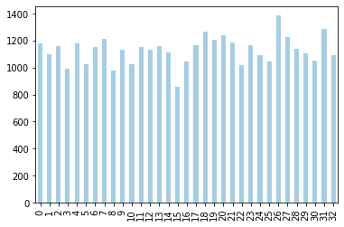

# 快速入门 DAE 数据分析功能
-------


**DAE数据分析提供了非常类似Pandas的API，目前已经对齐了90%以上的方法和属性。但又区别于Pandas，DAE内部采用CPU多核加速、异构加速、高效存储、惰性计算等等技术，充分发挥硬件原生性能潜力。  
经过我们系统评估，在机器环境（CPU:28逻辑核,内存256G,Intel(R) Xeon(R）Gold 5117 CPU @2.00GHz）里，DAE数据处理量超过Pandas 8倍，性能加速超过10倍。**

## DAE 数据分析中的数据结构

DAE 数据分析提供两种数据类型，*Series* 和 *DataFrame*。

**Series** 是一种一维的数据类型，其中的每个元素都有各自的标签。如果你了解 Numpy，你可以把它当作一个由带标签的元素组成的 numpy 数组。标签可以是数字或者字符。

**DataFrame** 是一个二维的、表格型的数据结构。DAE 的 DataFrame 可以储存许多不同类型的数据，并且每个轴都有标签。你可以把它当作一个 series 的字典。

**这个文档简单介绍了DAE数据分析的常用接口。**

## 数据集介绍
样例中采用的小数据集是英国在若干年下雨量相关的统计信息，数据主要有33行 * 7 列，方便大家快速体验DAE 数据分析功能。 

|  列名   | 说明  |
|  ----  | ----  |
|  Water Year | 年份 |
| Rain (mm) Oct-Sep  | 九月到十月降平均雨量（毫米） |
| Outflow (m3/s) Oct-Sep  | 九月到十月总降雨量（立方米） |
| Rain (mm) Dec-Feb  | 十二月到一月降平均雨量（毫米） |
| Outflow (m3/s) Dec-Feb  | 十二月到一月总降雨量（立方米） |
| Rain (mm) Jun-Aug  | 七月到八月降平均雨量（毫米） |
| Outflow (m3/s) Jun-Aug  | 七月到八月总降雨量（立方米） |

### 下载数据集


```python
!wget --quiet --no-check-certificate https://bj.bcebos.com/v1/codelab-demos/uk_rain_2014.csv
!wget --quiet --no-check-certificate https://bj.bcebos.com/v1/codelab-demos/uk_rain.parquet
```

# 1. 如何导入DAE数据分析库？

大家经常看到Pandas的导入方法是“import pandas as pd”，而DAE接口对齐了Pandas 90%以上的方法和属性，  
所以 **对于很多Pandas程序只要将“import pandas as pd” 替换成 “import blackhole.dataframe as pd”** ,  
一句代码修改就可以体验的超大数据处理能力和加速效果。  
当然你也可以命名为任何你喜欢的名字，比如“import blackhole.dataframe as bhdf”。


```python
import blackhole.dataframe as pd
```


<style type='text/css'>
.datatable table.frame { margin-bottom: 0; }
.datatable table.frame thead { border-bottom: none; }
.datatable table.frame tr.coltypes td {  color: #FFFFFF;  line-height: 6px;  padding: 0 0.5em;}
.datatable .bool    { background: #DDDD99; }
.datatable .object  { background: #565656; }
.datatable .int     { background: #5D9E5D; }
.datatable .float   { background: #4040CC; }
.datatable .str     { background: #CC4040; }
.datatable .time    { background: #40CC40; }
.datatable .row_index {  background: var(--jp-border-color3);  border-right: 1px solid var(--jp-border-color0);  color: var(--jp-ui-font-color3);  font-size: 9px;}
.datatable .frame tbody td { text-align: left; }
.datatable .frame tr.coltypes .row_index {  background: var(--jp-border-color0);}
.datatable th:nth-child(2) { padding-left: 12px; }
.datatable .hellipsis {  color: var(--jp-cell-editor-border-color);}
.datatable .vellipsis {  background: var(--jp-layout-color0);  color: var(--jp-cell-editor-border-color);}
.datatable .na {  color: var(--jp-cell-editor-border-color);  font-size: 80%;}
.datatable .sp {  opacity: 0.25;}
.datatable .footer { font-size: 9px; }
.datatable .frame_dimensions {  background: var(--jp-border-color3);  border-top: 1px solid var(--jp-border-color0);  color: var(--jp-ui-font-color3);  display: inline-block;  opacity: 0.6;  padding: 1px 10px 1px 5px;}
.datatable .frame thead tr.colnames {  background-image: url('data:image/png;base64,iVBORw0KGgoAAAANSUhEUgAAABwAAAA4CAYAAADuMJi0AAAGR0lEQVR42rVZ21IbRxBtCbQrkIR2dQVjsLmDLBsET3nTQ8ouYRkQVf6e/E9+Im958qMfkgoXAaKSSj6C9Jnd2R2NeiRSRaZqitVOT5+Z6dNnWoKGlN94JFp8Ipofkb/7SOXjGyp8wF+z35K3f0uUp/GW4XfLQ8v2gefj3ZCCzojoNfue+43o1Q3l3xB/yA3JO7jnF2pCLnI+pNyx/qw7L+SQ7T2N9p2f8c60QcfcK6KGXsAd+ZvA4LlZYuSSAoOhMs5vwJkEGDlbPMaJoA+FcQ0IH38QLWkbAFLkOOhoMF5tU6/eBRhNjro0ZgKiPRAt3FLhCO/vqdgmNTm32LkmKpvBmQY4q5uAaAgbwDBG2BVv3bfI8KKAMWj2kfw9+pkZREIbEql4ST1x7hgHIANkbJ//MF8mAH/ilTCJ2tIi4ASr1IC3VNqXHKOxjy34mgoImnOQtx1g81fkqTiMOBVGcTogNhiT5iBHET8R8C+iApJUmgim3SQAXhsLQz7ee2G8gOAQNtJckBEplADiAxtX+G9NmhDl0qJKnTvyWlAMPYZnvIviGXRg6/Dh824DBXhP/tbfREXJEIvQ+aaPGjG7pvw6r3xdx+9hqb4dgZaP2XmdHO2K/B0c1+oUph6k8kShBryl/Ft0DYgjTlOieOACHFFpVyUl72T9V3cM1jUoYvxIC2vpCSys/ck70mDYuYvdvKjlMdKAUThneWVU1aAsyjv6PURDiwNsHGBZzY+JtAAgE2TFxdRHJdyIp/f+zqu09M5cDP2F08Ukkpj4YNSdX950HY2pNCCUK/Hhx5ZMBfjNSEzdsIihVzzAMdn9dz4eDYhnyQb9SSCiAryiJcQk82LiTbJ4x2FZJaUenpKnzP95WyDf4Y+QN9EFHHSeDLGdBjjKNQ5vKHf4XMA7KrY0y0GEObBOO/8e1ywuQExOHXktuQyJALEBpcEqhwtHqgiDuCK5b6i0p2MQpcckIIoh+6hYgTZtO8xlMi6O4tKCF/kOGHEg/W0UUpHW0ZoGNZ1ExZWcn7EErgwt4uj50E/sFBjXXIayWvh7WryjasxarZKssXon0zxvvkc32Q0bqbBCuZiKt9dWFysfQefeL29JYFaeztX6tePaZdz5mYx8+6Zq3Mk0wXECQxlhdzgS2wjBHju3j1RIgKyOMdNUE8X0+RAdbSapS11MRCv1SzUXmO6wGZe2SQYrv2MvCSWEv2VODE6DN7bz8ufypgQKW7uQskFTQHULLKyaEyrnlZbgOGLrV5qrn9U79jjm2HJmgkaVN98AfBub91lGPLZBqdroN5LYgjSu4zYZDDHXZOIPC691HqrWI1900I8qLzgKP4ft8DxEWigprPfrO+KcXno9gZz4jjGewWdUcpGCj0qVFuGPYbl2VturndZ2qRvlL8acDO6lF/DY/VjsFesiUK+ypJ+r/ep+cJkSQxEK4PG4WozgA75TYrDDqStE69K8/mzGEM+JXTeqvmedEElMmwCMm2SLd6bNNF9su02zEtoW6nAQtpMj5Gd7fKa//wqonF7UdtHFsVn+6hf1o7AfriPH7M6EeIUEF5zKVxXbYo7kS/OEtOqDYZKPoBsETIixn0uYrasThmzDkhdKPkz2EnaX0HdQbIgr59vAdGYDqjHrxkjS7WOxkTD8sqEqhiwcJETgBYigrBqF08KyDaje9SZ/I1A7MzaTzMGDEulPtZUkuKcyIRAjxEJPVrnVlb/9wkfij31D/pQt1IN+iL8bGJcstBIO7Y5VI/cwDqURbXhMuJxBqD0KLoK3esWFs0Jz5i5ZvJUAfFJMFb9XmGIOnzGpijpcWYCaMqXSQWp8EnCABepQ0Elyi4wfKfsw78ikIqif1pe1AGPlLmojl1SKxHHXp1L+Ut7AmDQHvhI5xHGi4EooO2BR7k78PEkJOdL7cAxQUZ/Tyclu9gnfwGgOmm2lNHGNmZXsq4Pqgc1EG1ATrvKl8s4R9ywwnqulGUnaRLVhxy8v3ieUwy2hbooT68uscW++DCDH0WSzuoyN2D4LUJ/tLECbcSKznwMIFs0ChF4mRTCnQbIIfk4SHJo6A9BMuTnXTs3Ku/KxsgZWqzuSe+Os8cEUfnMBY6UF5gi3SUbd5K7vDjq5WW0UENJlRsWn4sy21Er/E/AvPQSFHy1p4fgAAAAASUVORK5CYII=');  background-repeat: repeat-x;  background-size: 14px;  height: 28px;}
</style>


    Iceberg operation not loaded.
    Application would run in codeGen mod


    Total 0 tables and 0 dictionaries.
    Starting up tables.
    Total 0 tables and 0 dictionaries.
    Starting up tables.
    Create BackgroundSchedulePool with 128 threads


# 2. 如何导入数据？

在对数据进行修改、探索和分析之前，我们得先导入数据，主要通过 **read_csv 或者 read_parquet** 方法。  
**read_csv**是导入常见的csv格式的数据集，而**read_parquet**是导入常见的parquet格式的数据集，这两个操作都返回一个DAE的Dataframe对象（blackhole.dataframe.frame.DataFrame）。    
    
    
**相比Pandas的read_csv和read_parquet，读取大数据量文件的时候，DAE能够加速10倍以上，内存可以节省5倍以上**。


```python
df = pd.read_csv('uk_rain_2014.csv', header=0)
```


```python
type(df)
```


    blackhole.dataframe.frame.DataFrame


```python
df2 = pd.read_parquet('uk_rain.parquet')
```


```python
type(df2)
```


    blackhole.dataframe.frame.DataFrame


# 3. 如何进行数据探索和分析？

## 3.1 查看前 x 行的数据


```python
# Getting first x rows.
df.head(5)
```


<div>
<style scoped>
    .dataframe tbody tr th:only-of-type {
        vertical-align: middle;
    }

    .dataframe tbody tr th {
        vertical-align: top;
    }

    .dataframe thead th {
        text-align: right;
    }
</style>
<table border="1" class="dataframe">
  <thead>
    <tr style="text-align: right;">
      <th></th>
      <th>Water Year</th>
      <th>Rain (mm) Oct-Sep</th>
      <th>Outflow (m3/s) Oct-Sep</th>
      <th>Rain (mm) Dec-Feb</th>
      <th>Outflow (m3/s) Dec-Feb</th>
      <th>Rain (mm) Jun-Aug</th>
      <th>Outflow (m3/s) Jun-Aug</th>
    </tr>
  </thead>
  <tbody>
    <tr>
      <th>0</th>
      <td>1980/81</td>
      <td>1182</td>
      <td>5408</td>
      <td>292</td>
      <td>7248</td>
      <td>174</td>
      <td>2212</td>
    </tr>
    <tr>
      <th>1</th>
      <td>1981/82</td>
      <td>1098</td>
      <td>5112</td>
      <td>257</td>
      <td>7316</td>
      <td>242</td>
      <td>1936</td>
    </tr>
    <tr>
      <th>2</th>
      <td>1982/83</td>
      <td>1156</td>
      <td>5701</td>
      <td>330</td>
      <td>8567</td>
      <td>124</td>
      <td>1802</td>
    </tr>
    <tr>
      <th>3</th>
      <td>1983/84</td>
      <td>993</td>
      <td>4265</td>
      <td>391</td>
      <td>8905</td>
      <td>141</td>
      <td>1078</td>
    </tr>
    <tr>
      <th>4</th>
      <td>1984/85</td>
      <td>1182</td>
      <td>5364</td>
      <td>217</td>
      <td>5813</td>
      <td>343</td>
      <td>4313</td>
    </tr>
  </tbody>
</table>
</div>


## 3.2 查看后 x 行的数据


```python
# Getting last x rows.
df.tail(5)
```


<div>
<style scoped>
    .dataframe tbody tr th:only-of-type {
        vertical-align: middle;
    }

    .dataframe tbody tr th {
        vertical-align: top;
    }

    .dataframe thead th {
        text-align: right;
    }
</style>
<table border="1" class="dataframe">
  <thead>
    <tr style="text-align: right;">
      <th></th>
      <th>Water Year</th>
      <th>Rain (mm) Oct-Sep</th>
      <th>Outflow (m3/s) Oct-Sep</th>
      <th>Rain (mm) Dec-Feb</th>
      <th>Outflow (m3/s) Dec-Feb</th>
      <th>Rain (mm) Jun-Aug</th>
      <th>Outflow (m3/s) Jun-Aug</th>
    </tr>
  </thead>
  <tbody>
    <tr>
      <th>28</th>
      <td>2008/09</td>
      <td>1139</td>
      <td>4941</td>
      <td>268</td>
      <td>6690</td>
      <td>323</td>
      <td>3189</td>
    </tr>
    <tr>
      <th>29</th>
      <td>2009/10</td>
      <td>1103</td>
      <td>4738</td>
      <td>255</td>
      <td>6435</td>
      <td>244</td>
      <td>1958</td>
    </tr>
    <tr>
      <th>30</th>
      <td>2010/11</td>
      <td>1053</td>
      <td>4521</td>
      <td>265</td>
      <td>6593</td>
      <td>267</td>
      <td>2885</td>
    </tr>
    <tr>
      <th>31</th>
      <td>2011/12</td>
      <td>1285</td>
      <td>5500</td>
      <td>339</td>
      <td>7630</td>
      <td>379</td>
      <td>5261</td>
    </tr>
    <tr>
      <th>32</th>
      <td>2012/13</td>
      <td>1090</td>
      <td>5329</td>
      <td>350</td>
      <td>9615</td>
      <td>187</td>
      <td>1797</td>
    </tr>
  </tbody>
</table>
</div>


## 3.3 修改列名
你通常使用列的名字来在 DAE 中查找列，但是有时列名太长，比如上面的“Rain (mm) Oct-Sep”，使用还挺麻烦，你可以把列名缩短之后一切就方便多了。


```python
# Changing column labels.
df.columns = ['water_year','rain_octsep', 'outflow_octsep',
              'rain_decfeb', 'outflow_decfeb', 'rain_junaug', 'outflow_junaug']

df.head(5)
```


<div>
<style scoped>
    .dataframe tbody tr th:only-of-type {
        vertical-align: middle;
    }

    .dataframe tbody tr th {
        vertical-align: top;
    }

    .dataframe thead th {
        text-align: right;
    }
</style>
<table border="1" class="dataframe">
  <thead>
    <tr style="text-align: right;">
      <th></th>
      <th>water_year</th>
      <th>rain_octsep</th>
      <th>outflow_octsep</th>
      <th>rain_decfeb</th>
      <th>outflow_decfeb</th>
      <th>rain_junaug</th>
      <th>outflow_junaug</th>
    </tr>
  </thead>
  <tbody>
    <tr>
      <th>0</th>
      <td>1980/81</td>
      <td>1182</td>
      <td>5408</td>
      <td>292</td>
      <td>7248</td>
      <td>174</td>
      <td>2212</td>
    </tr>
    <tr>
      <th>1</th>
      <td>1981/82</td>
      <td>1098</td>
      <td>5112</td>
      <td>257</td>
      <td>7316</td>
      <td>242</td>
      <td>1936</td>
    </tr>
    <tr>
      <th>2</th>
      <td>1982/83</td>
      <td>1156</td>
      <td>5701</td>
      <td>330</td>
      <td>8567</td>
      <td>124</td>
      <td>1802</td>
    </tr>
    <tr>
      <th>3</th>
      <td>1983/84</td>
      <td>993</td>
      <td>4265</td>
      <td>391</td>
      <td>8905</td>
      <td>141</td>
      <td>1078</td>
    </tr>
    <tr>
      <th>4</th>
      <td>1984/85</td>
      <td>1182</td>
      <td>5364</td>
      <td>217</td>
      <td>5813</td>
      <td>343</td>
      <td>4313</td>
    </tr>
  </tbody>
</table>
</div>


## 3.4 数据查看
你通常会想快速浏览数据集，比如查看数据有多少行、多少列，以及每列类型等，可以通过 **info**方法。  
看下面执行结果，就知道这个数据集有33行*7列。


```python
df.info()
```

    <class 'blackhole.dataframe.frame.DataFrame'>
    Index: 33 entries, 0 to 32
    Data columns (total 7 columns):
     #   Column          Non-Null Count  Dtype 
    ---  ------          --------------  ----- 
     0   water_year      33 non-null     object
     1   rain_octsep     33 non-null     int32 
     2   outflow_octsep  33 non-null     int32 
     3   rain_decfeb     33 non-null     int32 
     4   outflow_decfeb  33 non-null     int32 
     5   rain_junaug     33 non-null     int32 
     6   outflow_junaug  33 non-null     int32 
    dtypes: int32(6), object(1)

## 3.5 数据统计
你可能还想知道数据集的一些基本的统计信息，可以通过 **describe** 方法。describe将返回一张表，其中有诸如总数、均值、标准差之类的统计数据：


```python
df.describe()
```


<div>
<style scoped>
    .dataframe tbody tr th:only-of-type {
        vertical-align: middle;
    }

    .dataframe tbody tr th {
        vertical-align: top;
    }

    .dataframe thead th {
        text-align: right;
    }
</style>
<table border="1" class="dataframe">
  <thead>
    <tr style="text-align: right;">
      <th></th>
      <th>rain_octsep</th>
      <th>outflow_octsep</th>
      <th>rain_decfeb</th>
      <th>outflow_decfeb</th>
      <th>rain_junaug</th>
      <th>outflow_junaug</th>
    </tr>
  </thead>
  <tbody>
    <tr>
      <th>count</th>
      <td>33.000000</td>
      <td>33.000000</td>
      <td>33.000000</td>
      <td>33.000000</td>
      <td>33.000000</td>
      <td>33.000000</td>
    </tr>
    <tr>
      <th>mean</th>
      <td>1129.000000</td>
      <td>5019.181818</td>
      <td>325.363636</td>
      <td>7926.545455</td>
      <td>237.484848</td>
      <td>2439.757576</td>
    </tr>
    <tr>
      <th>std</th>
      <td>101.900074</td>
      <td>658.587762</td>
      <td>69.995008</td>
      <td>1692.800049</td>
      <td>66.167931</td>
      <td>1025.914106</td>
    </tr>
    <tr>
      <th>min</th>
      <td>856.000000</td>
      <td>3479.000000</td>
      <td>206.000000</td>
      <td>4578.000000</td>
      <td>103.000000</td>
      <td>1078.000000</td>
    </tr>
    <tr>
      <th>25%</th>
      <td>1053.000000</td>
      <td>4506.000000</td>
      <td>268.000000</td>
      <td>6690.000000</td>
      <td>193.000000</td>
      <td>1797.000000</td>
    </tr>
    <tr>
      <th>50%</th>
      <td>1139.000000</td>
      <td>5112.000000</td>
      <td>309.000000</td>
      <td>7630.000000</td>
      <td>229.000000</td>
      <td>2142.000000</td>
    </tr>
    <tr>
      <th>75%</th>
      <td>1182.000000</td>
      <td>5497.000000</td>
      <td>360.000000</td>
      <td>8905.000000</td>
      <td>280.000000</td>
      <td>2959.000000</td>
    </tr>
    <tr>
      <th>max</th>
      <td>1387.000000</td>
      <td>6391.000000</td>
      <td>484.000000</td>
      <td>11486.000000</td>
      <td>379.000000</td>
      <td>5261.000000</td>
    </tr>
  </tbody>
</table>
</div>


## 3.6 过滤

（1）有时你想提取一整列，使用列的标签可以非常简单地做到，当我们提取列的时候，**会得到一个 series** ，而不是 dataframe 。记得我们前面提到过，你可以把 **dataframe 看作是一个 series 的字典**，所以在抽取列的时候，我们就会得到一个 series。


```python
df['rain_octsep'][:5]
```


    0    1182
    1    1098
    2    1156
    3     993
    4    1182
    Name: rain_octsep, dtype: int32


（2）我们也可以像访问对象属性一样访问数据集的列：**只用一个点号**。


```python
# Getting a column by label using .
df.rain_octsep[:5]
```


    0    1182
    1    1098
    2    1156
    3     993
    4    1182
    Name: rain_octsep, dtype: int32


（3）还可以通过 **布尔过滤（boolean masking）**的技术，得到一个*布林数组*，借助布林数组来过滤。  
    下面代码将会返回一个由布尔值构成的 Series。True 表示在十月-九月降雨量小于 1000 mm，False 表示大于等于 1000 mm


```python
# Creating a series of booleans based on a conditional
df.rain_octsep[:5] < 1000 # Or df['rain_octsep] < 1000
```


    0    False
    1    False
    2    False
    3     True
    4    False
    Name: rain_octsep, dtype: bool


```python
# Using a series of booleans to filter
df[df.rain_octsep < 1000]
```


<div>
<style scoped>
    .dataframe tbody tr th:only-of-type {
        vertical-align: middle;
    }

    .dataframe tbody tr th {
        vertical-align: top;
    }

    .dataframe thead th {
        text-align: right;
    }
</style>
<table border="1" class="dataframe">
  <thead>
    <tr style="text-align: right;">
      <th></th>
      <th>water_year</th>
      <th>rain_octsep</th>
      <th>outflow_octsep</th>
      <th>rain_decfeb</th>
      <th>outflow_decfeb</th>
      <th>rain_junaug</th>
      <th>outflow_junaug</th>
    </tr>
  </thead>
  <tbody>
    <tr>
      <th>3</th>
      <td>1983/84</td>
      <td>993</td>
      <td>4265</td>
      <td>391</td>
      <td>8905</td>
      <td>141</td>
      <td>1078</td>
    </tr>
    <tr>
      <th>8</th>
      <td>1988/89</td>
      <td>976</td>
      <td>4330</td>
      <td>309</td>
      <td>6465</td>
      <td>200</td>
      <td>1440</td>
    </tr>
    <tr>
      <th>15</th>
      <td>1995/96</td>
      <td>856</td>
      <td>3479</td>
      <td>245</td>
      <td>5515</td>
      <td>172</td>
      <td>1439</td>
    </tr>
  </tbody>
</table>
</div>


(4) 还可以通过复杂表达式来进行过滤，下面这行代码只会返回“rain_octsep小于1000和outflow_octsep小于4000”的记录。  
***注意：这里不能用 and 关键字，因为会引发操作顺序的问题，必须用 & 和圆括号。***


```python
# Filtering by multiple conditionals
# Can't use the keyword 'and'
df[(df.rain_octsep < 1000) & (df.outflow_octsep < 4000)] 
```


<div>
<style scoped>
    .dataframe tbody tr th:only-of-type {
        vertical-align: middle;
    }

    .dataframe tbody tr th {
        vertical-align: top;
    }

    .dataframe thead th {
        text-align: right;
    }
</style>
<table border="1" class="dataframe">
  <thead>
    <tr style="text-align: right;">
      <th></th>
      <th>water_year</th>
      <th>rain_octsep</th>
      <th>outflow_octsep</th>
      <th>rain_decfeb</th>
      <th>outflow_decfeb</th>
      <th>rain_junaug</th>
      <th>outflow_junaug</th>
    </tr>
  </thead>
  <tbody>
    <tr>
      <th>15</th>
      <td>1995/96</td>
      <td>856</td>
      <td>3479</td>
      <td>245</td>
      <td>5515</td>
      <td>172</td>
      <td>1439</td>
    </tr>
  </tbody>
</table>
</div>


(5) 如果你的数据中如果有字符串类型，你也可以使用字符串方法来进行过滤。比如下面的代码返回所有 90 年代的记录。  
***注意，你必须用 .str.[string method] ，而不能直接在字符串上调用字符方法***


```python
# Filtering by string methods
df[df.water_year.str.startswith('199')]
```


<div>
<style scoped>
    .dataframe tbody tr th:only-of-type {
        vertical-align: middle;
    }

    .dataframe tbody tr th {
        vertical-align: top;
    }

    .dataframe thead th {
        text-align: right;
    }
</style>
<table border="1" class="dataframe">
  <thead>
    <tr style="text-align: right;">
      <th></th>
      <th>water_year</th>
      <th>rain_octsep</th>
      <th>outflow_octsep</th>
      <th>rain_decfeb</th>
      <th>outflow_decfeb</th>
      <th>rain_junaug</th>
      <th>outflow_junaug</th>
    </tr>
  </thead>
  <tbody>
    <tr>
      <th>10</th>
      <td>1990/91</td>
      <td>1022</td>
      <td>4418</td>
      <td>305</td>
      <td>7120</td>
      <td>216</td>
      <td>1923</td>
    </tr>
    <tr>
      <th>11</th>
      <td>1991/92</td>
      <td>1151</td>
      <td>4506</td>
      <td>246</td>
      <td>5493</td>
      <td>280</td>
      <td>2118</td>
    </tr>
    <tr>
      <th>12</th>
      <td>1992/93</td>
      <td>1130</td>
      <td>5246</td>
      <td>308</td>
      <td>8751</td>
      <td>219</td>
      <td>2551</td>
    </tr>
    <tr>
      <th>13</th>
      <td>1993/94</td>
      <td>1162</td>
      <td>5583</td>
      <td>422</td>
      <td>10109</td>
      <td>193</td>
      <td>1638</td>
    </tr>
    <tr>
      <th>14</th>
      <td>1994/95</td>
      <td>1110</td>
      <td>5370</td>
      <td>484</td>
      <td>11486</td>
      <td>103</td>
      <td>1231</td>
    </tr>
    <tr>
      <th>15</th>
      <td>1995/96</td>
      <td>856</td>
      <td>3479</td>
      <td>245</td>
      <td>5515</td>
      <td>172</td>
      <td>1439</td>
    </tr>
    <tr>
      <th>16</th>
      <td>1996/97</td>
      <td>1047</td>
      <td>4019</td>
      <td>258</td>
      <td>5770</td>
      <td>256</td>
      <td>2102</td>
    </tr>
    <tr>
      <th>17</th>
      <td>1997/98</td>
      <td>1169</td>
      <td>4953</td>
      <td>341</td>
      <td>7747</td>
      <td>285</td>
      <td>3206</td>
    </tr>
    <tr>
      <th>18</th>
      <td>1998/99</td>
      <td>1268</td>
      <td>5824</td>
      <td>360</td>
      <td>8771</td>
      <td>225</td>
      <td>2240</td>
    </tr>
    <tr>
      <th>19</th>
      <td>1999/00</td>
      <td>1204</td>
      <td>5665</td>
      <td>417</td>
      <td>10021</td>
      <td>197</td>
      <td>2166</td>
    </tr>
  </tbody>
</table>
</div>


## 3.7 索引

之前的部分展示了如何通过列操作来得到数据，现在介绍下如何通过行标签来获取数据。**DAE行标签可以是基于数字的或者是其他类型的标签，根据标签的类型获取数据的方法也有所不同**

(1) 如果你的行标签是**数字型**的，你可以通过 ***iloc***来引用，它会返回指定行号的数据，并组装成 ***series***对象返回。


```python
# Getting a row via a numerical index
df.iloc[30]
```


    water_year        2010/11
    rain_octsep          1053
    outflow_octsep       4521
    rain_decfeb           265
    outflow_decfeb       6593
    rain_junaug           267
    outflow_junaug       2885
    Name: 0, dtype: object


(2) 如果不是数字型的，比如也许你的数据集中有年份或者年龄的列，你可能想通过这些年份或者年龄来引用行，这个时候我们就可以设置一个（或者多个）新的索引：


```python
#Setting a new index from an existing column
df = df.set_index(['water_year'])
df.head(5)
```


<div>
<style scoped>
    .dataframe tbody tr th:only-of-type {
        vertical-align: middle;
    }

    .dataframe tbody tr th {
        vertical-align: top;
    }

    .dataframe thead th {
        text-align: right;
    }
</style>
<table border="1" class="dataframe">
  <thead>
    <tr style="text-align: right;">
      <th></th>
      <th>rain_octsep</th>
      <th>outflow_octsep</th>
      <th>rain_decfeb</th>
      <th>outflow_decfeb</th>
      <th>rain_junaug</th>
      <th>outflow_junaug</th>
    </tr>
    <tr>
      <th>water_year</th>
      <th></th>
      <th></th>
      <th></th>
      <th></th>
      <th></th>
      <th></th>
    </tr>
  </thead>
  <tbody>
    <tr>
      <th>1980/81</th>
      <td>1182</td>
      <td>5408</td>
      <td>292</td>
      <td>7248</td>
      <td>174</td>
      <td>2212</td>
    </tr>
    <tr>
      <th>1981/82</th>
      <td>1098</td>
      <td>5112</td>
      <td>257</td>
      <td>7316</td>
      <td>242</td>
      <td>1936</td>
    </tr>
    <tr>
      <th>1982/83</th>
      <td>1156</td>
      <td>5701</td>
      <td>330</td>
      <td>8567</td>
      <td>124</td>
      <td>1802</td>
    </tr>
    <tr>
      <th>1983/84</th>
      <td>993</td>
      <td>4265</td>
      <td>391</td>
      <td>8905</td>
      <td>141</td>
      <td>1078</td>
    </tr>
    <tr>
      <th>1984/85</th>
      <td>1182</td>
      <td>5364</td>
      <td>217</td>
      <td>5813</td>
      <td>343</td>
      <td>4313</td>
    </tr>
  </tbody>
</table>
</div>


上面的代码将 water_year 列设置为索引。***注意，列的名字实际上是一个列表***，虽然上面的例子中只有一个元素。如果你想设置多个索引，只需要在列表中加入列的名字即可。

上例中我们设置的索引列中都是字符型数据，这意味着我们不能继续使用 iloc 来引用，那我们用什么呢？用 loc 。


```python
# Getting a row via a label-based index
df.loc['2000/01']
```


    1239


和 ***iloc*** 一样，***loc*** 会返回你引用的列，唯一一点不同就是此时你使用的是基于字符串的引用，而不是基于数字的。

## 3.8 排序

排序通常会很有用，在 blackhole 中，我们可以对 dataframe 调用 sort_values 方法进行排序。


```python
# inplace = True to apply the sorting in place
df.sort_values(['rain_octsep']).head(5)
```


<div>
<style scoped>
    .dataframe tbody tr th:only-of-type {
        vertical-align: middle;
    }

    .dataframe tbody tr th {
        vertical-align: top;
    }

    .dataframe thead th {
        text-align: right;
    }
</style>
<table border="1" class="dataframe">
  <thead>
    <tr style="text-align: right;">
      <th></th>
      <th>rain_octsep</th>
      <th>outflow_octsep</th>
      <th>rain_decfeb</th>
      <th>outflow_decfeb</th>
      <th>rain_junaug</th>
      <th>outflow_junaug</th>
    </tr>
    <tr>
      <th>water_year</th>
      <th></th>
      <th></th>
      <th></th>
      <th></th>
      <th></th>
      <th></th>
    </tr>
  </thead>
  <tbody>
    <tr>
      <th>1995/96</th>
      <td>856</td>
      <td>3479</td>
      <td>245</td>
      <td>5515</td>
      <td>172</td>
      <td>1439</td>
    </tr>
    <tr>
      <th>1988/89</th>
      <td>976</td>
      <td>4330</td>
      <td>309</td>
      <td>6465</td>
      <td>200</td>
      <td>1440</td>
    </tr>
    <tr>
      <th>1983/84</th>
      <td>993</td>
      <td>4265</td>
      <td>391</td>
      <td>8905</td>
      <td>141</td>
      <td>1078</td>
    </tr>
    <tr>
      <th>2002/03</th>
      <td>1021</td>
      <td>4366</td>
      <td>272</td>
      <td>7093</td>
      <td>176</td>
      <td>1478</td>
    </tr>
    <tr>
      <th>1990/91</th>
      <td>1022</td>
      <td>4418</td>
      <td>305</td>
      <td>7120</td>
      <td>216</td>
      <td>1923</td>
    </tr>
  </tbody>
</table>
</div>


当你将一列设置为索引的时候，它就不再是数据的一部分了。如果你想将索引恢复为数据，调用 ***set_index*** 相反的方法 ***reset_index*** 即可：


```python
# Returning an index to data
df = df.reset_index('water_year')
df.head(5)
```


<div>
<style scoped>
    .dataframe tbody tr th:only-of-type {
        vertical-align: middle;
    }

    .dataframe tbody tr th {
        vertical-align: top;
    }

    .dataframe thead th {
        text-align: right;
    }
</style>
<table border="1" class="dataframe">
  <thead>
    <tr style="text-align: right;">
      <th></th>
      <th>water_year</th>
      <th>rain_octsep</th>
      <th>outflow_octsep</th>
      <th>rain_decfeb</th>
      <th>outflow_decfeb</th>
      <th>rain_junaug</th>
      <th>outflow_junaug</th>
    </tr>
  </thead>
  <tbody>
    <tr>
      <th>0</th>
      <td>1980/81</td>
      <td>1182</td>
      <td>5408</td>
      <td>292</td>
      <td>7248</td>
      <td>174</td>
      <td>2212</td>
    </tr>
    <tr>
      <th>1</th>
      <td>1981/82</td>
      <td>1098</td>
      <td>5112</td>
      <td>257</td>
      <td>7316</td>
      <td>242</td>
      <td>1936</td>
    </tr>
    <tr>
      <th>2</th>
      <td>1982/83</td>
      <td>1156</td>
      <td>5701</td>
      <td>330</td>
      <td>8567</td>
      <td>124</td>
      <td>1802</td>
    </tr>
    <tr>
      <th>3</th>
      <td>1983/84</td>
      <td>993</td>
      <td>4265</td>
      <td>391</td>
      <td>8905</td>
      <td>141</td>
      <td>1078</td>
    </tr>
    <tr>
      <th>4</th>
      <td>1984/85</td>
      <td>1182</td>
      <td>5364</td>
      <td>217</td>
      <td>5813</td>
      <td>343</td>
      <td>4313</td>
    </tr>
  </tbody>
</table>
</div>


## 3.9 删除列

有时候，你希望删除一些数据，比如删除某些不需要的列，这时候你可以调用drop函数


```python
df.drop(['outflow_junaug'], axis=1).head()
```


<div>
<style scoped>
    .dataframe tbody tr th:only-of-type {
        vertical-align: middle;
    }

    .dataframe tbody tr th {
        vertical-align: top;
    }

    .dataframe thead th {
        text-align: right;
    }
</style>
<table border="1" class="dataframe">
  <thead>
    <tr style="text-align: right;">
      <th></th>
      <th>water_year</th>
      <th>rain_octsep</th>
      <th>outflow_octsep</th>
      <th>rain_decfeb</th>
      <th>outflow_decfeb</th>
      <th>rain_junaug</th>
    </tr>
  </thead>
  <tbody>
    <tr>
      <th>0</th>
      <td>1980/81</td>
      <td>1182</td>
      <td>5408</td>
      <td>292</td>
      <td>7248</td>
      <td>174</td>
    </tr>
    <tr>
      <th>1</th>
      <td>1981/82</td>
      <td>1098</td>
      <td>5112</td>
      <td>257</td>
      <td>7316</td>
      <td>242</td>
    </tr>
    <tr>
      <th>2</th>
      <td>1982/83</td>
      <td>1156</td>
      <td>5701</td>
      <td>330</td>
      <td>8567</td>
      <td>124</td>
    </tr>
    <tr>
      <th>3</th>
      <td>1983/84</td>
      <td>993</td>
      <td>4265</td>
      <td>391</td>
      <td>8905</td>
      <td>141</td>
    </tr>
    <tr>
      <th>4</th>
      <td>1984/85</td>
      <td>1182</td>
      <td>5364</td>
      <td>217</td>
      <td>5813</td>
      <td>343</td>
    </tr>
  </tbody>
</table>
</div>


## 3.10 缺失值处理

有时候数据中有一些缺失值，你希望将其填充某个固定的值来替换缺失值，这时候你可以调用fillna函数，将缺失的值都替换为-1，表示数据缺失


```python
df.fillna(-1).head()
```


<div>
<style scoped>
    .dataframe tbody tr th:only-of-type {
        vertical-align: middle;
    }

    .dataframe tbody tr th {
        vertical-align: top;
    }

    .dataframe thead th {
        text-align: right;
    }
</style>
<table border="1" class="dataframe">
  <thead>
    <tr style="text-align: right;">
      <th></th>
      <th>water_year</th>
      <th>rain_octsep</th>
      <th>outflow_octsep</th>
      <th>rain_decfeb</th>
      <th>outflow_decfeb</th>
      <th>rain_junaug</th>
      <th>outflow_junaug</th>
    </tr>
  </thead>
  <tbody>
    <tr>
      <th>0</th>
      <td>1980/81</td>
      <td>1182</td>
      <td>5408</td>
      <td>292</td>
      <td>7248</td>
      <td>174</td>
      <td>2212</td>
    </tr>
    <tr>
      <th>1</th>
      <td>1981/82</td>
      <td>1098</td>
      <td>5112</td>
      <td>257</td>
      <td>7316</td>
      <td>242</td>
      <td>1936</td>
    </tr>
    <tr>
      <th>2</th>
      <td>1982/83</td>
      <td>1156</td>
      <td>5701</td>
      <td>330</td>
      <td>8567</td>
      <td>124</td>
      <td>1802</td>
    </tr>
    <tr>
      <th>3</th>
      <td>1983/84</td>
      <td>993</td>
      <td>4265</td>
      <td>391</td>
      <td>8905</td>
      <td>141</td>
      <td>1078</td>
    </tr>
    <tr>
      <th>4</th>
      <td>1984/85</td>
      <td>1182</td>
      <td>5364</td>
      <td>217</td>
      <td>5813</td>
      <td>343</td>
      <td>4313</td>
    </tr>
  </tbody>
</table>
</div>


## 3.11 对数据集应用函数

有时你想对数据集中的数据进行改变或者某种操作。比方说，你有一列年份的数据，你需要新的一列来表示这些年份对应的年代。DAE 中有两个非常有用的函数***apply 和 applymap***。


```python
# Applying a funciton to a column
def base_year(year):
    base_year = year[:4]
    base_year = pd.to_datetime(base_year).year
    return base_year

df['year'] = df.water_year.apply(base_year)
df.head(5)
```


<div>
<style scoped>
    .dataframe tbody tr th:only-of-type {
        vertical-align: middle;
    }

    .dataframe tbody tr th {
        vertical-align: top;
    }

    .dataframe thead th {
        text-align: right;
    }
</style>
<table border="1" class="dataframe">
  <thead>
    <tr style="text-align: right;">
      <th></th>
      <th>water_year</th>
      <th>rain_octsep</th>
      <th>outflow_octsep</th>
      <th>rain_decfeb</th>
      <th>outflow_decfeb</th>
      <th>rain_junaug</th>
      <th>outflow_junaug</th>
      <th>year</th>
    </tr>
  </thead>
  <tbody>
    <tr>
      <th>0</th>
      <td>1980/81</td>
      <td>1182</td>
      <td>5408</td>
      <td>292</td>
      <td>7248</td>
      <td>174</td>
      <td>2212</td>
      <td>1980</td>
    </tr>
    <tr>
      <th>1</th>
      <td>1981/82</td>
      <td>1098</td>
      <td>5112</td>
      <td>257</td>
      <td>7316</td>
      <td>242</td>
      <td>1936</td>
      <td>1981</td>
    </tr>
    <tr>
      <th>2</th>
      <td>1982/83</td>
      <td>1156</td>
      <td>5701</td>
      <td>330</td>
      <td>8567</td>
      <td>124</td>
      <td>1802</td>
      <td>1982</td>
    </tr>
    <tr>
      <th>3</th>
      <td>1983/84</td>
      <td>993</td>
      <td>4265</td>
      <td>391</td>
      <td>8905</td>
      <td>141</td>
      <td>1078</td>
      <td>1983</td>
    </tr>
    <tr>
      <th>4</th>
      <td>1984/85</td>
      <td>1182</td>
      <td>5364</td>
      <td>217</td>
      <td>5813</td>
      <td>343</td>
      <td>4313</td>
      <td>1984</td>
    </tr>
  </tbody>
</table>
</div>


## 3.12 操作数据集的结构

另一常见的做法是重新建立数据结构，使得数据集呈现出一种更方便并且（或者）有用的形式。

掌握这些转换最简单的方法就是观察转换的过程。比起这篇文章的其他部分，接下来的操作需要你跟着练习以便能掌握它们。

首先，是 ***groupby***：***groupby***会按照你选择的列对数据集进行分组。上例是按照年代分组。不过仅仅这样做并没有什么用，我们必须对其调用函数，比如 max 、 min 、mean 等等。例中，我们可以得到 90 年代的均值。


```python
#Manipulating structure (groupby, unstack, pivot)
#Groupby
df.groupby(['year']).max().head()
```


<div>
<style scoped>
    .dataframe tbody tr th:only-of-type {
        vertical-align: middle;
    }

    .dataframe tbody tr th {
        vertical-align: top;
    }

    .dataframe thead th {
        text-align: right;
    }
</style>
<table border="1" class="dataframe">
  <thead>
    <tr style="text-align: right;">
      <th></th>
      <th>water_year</th>
      <th>rain_octsep</th>
      <th>outflow_octsep</th>
      <th>rain_decfeb</th>
      <th>outflow_decfeb</th>
      <th>rain_junaug</th>
      <th>outflow_junaug</th>
    </tr>
    <tr>
      <th>year</th>
      <th></th>
      <th></th>
      <th></th>
      <th></th>
      <th></th>
      <th></th>
      <th></th>
    </tr>
  </thead>
  <tbody>
    <tr>
      <th>1980</th>
      <td>1980/81</td>
      <td>1182</td>
      <td>5408</td>
      <td>292</td>
      <td>7248</td>
      <td>174</td>
      <td>2212</td>
    </tr>
    <tr>
      <th>1981</th>
      <td>1981/82</td>
      <td>1098</td>
      <td>5112</td>
      <td>257</td>
      <td>7316</td>
      <td>242</td>
      <td>1936</td>
    </tr>
    <tr>
      <th>1982</th>
      <td>1982/83</td>
      <td>1156</td>
      <td>5701</td>
      <td>330</td>
      <td>8567</td>
      <td>124</td>
      <td>1802</td>
    </tr>
    <tr>
      <th>1983</th>
      <td>1983/84</td>
      <td>993</td>
      <td>4265</td>
      <td>391</td>
      <td>8905</td>
      <td>141</td>
      <td>1078</td>
    </tr>
    <tr>
      <th>1984</th>
      <td>1984/85</td>
      <td>1182</td>
      <td>5364</td>
      <td>217</td>
      <td>5813</td>
      <td>343</td>
      <td>4313</td>
    </tr>
  </tbody>
</table>
</div>


你也可以按照多列进行分组：


```python
# Grouping bu mutileple columns
decade_rain = df.groupby(['year', 'rain_octsep'])[['outflow_octsep', 'outflow_decfeb', 'outflow_junaug']].mean()
decade_rain.head()                                                    
```


<div>
<style scoped>
    .dataframe tbody tr th:only-of-type {
        vertical-align: middle;
    }

    .dataframe tbody tr th {
        vertical-align: top;
    }

    .dataframe thead th {
        text-align: right;
    }
</style>
<table border="1" class="dataframe">
  <thead>
    <tr style="text-align: right;">
      <th></th>
      <th>outflow_octsep</th>
      <th>outflow_decfeb</th>
      <th>outflow_junaug</th>
    </tr>
    <tr>
      <th>year</th>
      <th></th>
      <th></th>
      <th></th>
    </tr>
  </thead>
  <tbody>
    <tr>
      <th>1980</th>
      <td>5408.0</td>
      <td>7248.0</td>
      <td>2212.0</td>
    </tr>
    <tr>
      <th>1981</th>
      <td>5112.0</td>
      <td>7316.0</td>
      <td>1936.0</td>
    </tr>
    <tr>
      <th>1982</th>
      <td>5701.0</td>
      <td>8567.0</td>
      <td>1802.0</td>
    </tr>
    <tr>
      <th>1983</th>
      <td>4265.0</td>
      <td>8905.0</td>
      <td>1078.0</td>
    </tr>
    <tr>
      <th>1984</th>
      <td>5364.0</td>
      <td>5813.0</td>
      <td>4313.0</td>
    </tr>
  </tbody>
</table>
</div>


# 3.13 合并数据集

有时你有两个相关联的数据集，你想将它们放在一起比较或者合并它们, 可以通过**merge 或者 join**方法，通过***on***关键字来指定需要合并的列。  

如下图所示，我们先从**df2**中提取年份和降雨量两列生成**rain** 数据集，然后**df**与**rain**通过年份列**year**进行合并，将两个数据集的降雨量都合并到**uk_jpn_rain**数据集中。


```python
# Merging two datasets together
rain = df2[['year', 'rain_octsep']]

uk_jpn_rain = df.merge(rain, on='year')
uk_jpn_rain.head(5)
```


<div>
<style scoped>
    .dataframe tbody tr th:only-of-type {
        vertical-align: middle;
    }

    .dataframe tbody tr th {
        vertical-align: top;
    }

    .dataframe thead th {
        text-align: right;
    }
</style>
<table border="1" class="dataframe">
  <thead>
    <tr style="text-align: right;">
      <th></th>
      <th>water_year</th>
      <th>rain_octsep_x</th>
      <th>outflow_octsep</th>
      <th>rain_decfeb</th>
      <th>outflow_decfeb</th>
      <th>rain_junaug</th>
      <th>outflow_junaug</th>
      <th>year</th>
      <th>rain_octsep_y</th>
    </tr>
  </thead>
  <tbody>
    <tr>
      <th>0</th>
      <td>1980/81</td>
      <td>1182</td>
      <td>5408</td>
      <td>292</td>
      <td>7248</td>
      <td>174</td>
      <td>2212</td>
      <td>1980</td>
      <td>1182</td>
    </tr>
    <tr>
      <th>1</th>
      <td>1981/82</td>
      <td>1098</td>
      <td>5112</td>
      <td>257</td>
      <td>7316</td>
      <td>242</td>
      <td>1936</td>
      <td>1981</td>
      <td>1098</td>
    </tr>
    <tr>
      <th>2</th>
      <td>1982/83</td>
      <td>1156</td>
      <td>5701</td>
      <td>330</td>
      <td>8567</td>
      <td>124</td>
      <td>1802</td>
      <td>1982</td>
      <td>1156</td>
    </tr>
    <tr>
      <th>3</th>
      <td>1983/84</td>
      <td>993</td>
      <td>4265</td>
      <td>391</td>
      <td>8905</td>
      <td>141</td>
      <td>1078</td>
      <td>1983</td>
      <td>993</td>
    </tr>
    <tr>
      <th>4</th>
      <td>1984/85</td>
      <td>1182</td>
      <td>5364</td>
      <td>217</td>
      <td>5813</td>
      <td>343</td>
      <td>4313</td>
      <td>1984</td>
      <td>1182</td>
    </tr>
  </tbody>
</table>
</div>


## 3.14 使用 DAE 快速作图

<font color = red>***Matplotlib*** </font> 很棒，但是想要绘制出还算不错的图表却要写不少代码，而有时你只是想粗略的做个图来探索下数据，搞清楚数据的含义。DAE 通过 *plot* 来解决这个问题：


```python
# Using blackhole to quickly plot graphs
uk_jpn_rain['rain_octsep_x'].plot(kind='bar', colormap='Paired')
```


    <AxesSubplot:>


    

    


这会调用 Matplotlib 快速轻松地绘出了你的数据图。通过这个图你就可以在视觉上分析数据，而且它能在探索数据的时候给你一些方向。

你会发现英国的降雨明显少于日本，但人们却说英国总是下雨。

## 3.15 保存你的数据集

在清洗、重塑、探索完数据之后，你最后的数据集可能会发生很大改变，你可以保存处理后的数据集，以便下次使用。  
DAE 支持将数据集导出成我们常见的数据格式，比如csv和parquet格式。


```python
# Saving your data to a csv
uk_jpn_rain.to_csv('output.csv')
```


```python
# Saving your data to a parquet
uk_jpn_rain.to_csv('output.parquet')
```


我们这里先介绍DAE数据分析部分常见的API，事实上我们已经能够对齐了Pandas 90%+的方法和属性，这里就不一一展开介绍，详细的使用方法我们可以参照Pandas的接口文档：https://pandas.pydata.org/pandas-docs/stable/reference/frame.html

